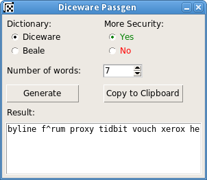

PyDice
========
A python script with graphical menu for generating diceware passphrases. Works in Linux and Windows.

Usage
-----
In menu you can choose:

* **Dictionary**: dictionary of words to use (default is '*diceware*' and optionally '*beale*').
* **More security**: replace a random character from a random word of generated passphrase.
* **Number of words**: number of words of generated passphrase.

Buttons:

* **Generate**: generates the passphrase in textbox.
* **Copy to Clipboard**: copy content of textbox to clipboard.

Diceware info
-------------
More info about diceware works [here](http://world.std.com/~reinhold/diceware.html).

